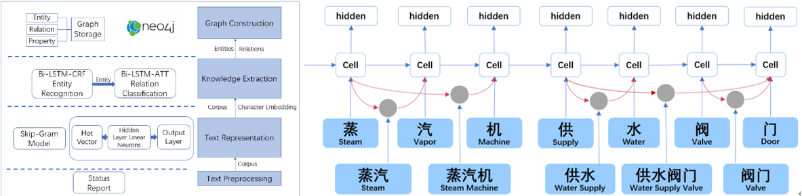

I'm a senior student of ECE Department at [Zhejiang University/University of Illinois at Urbana-Champaign Institute](https://zjui.intl.zju.edu.cn/).

I am currently working on my bachelor degree of engineering and am also involved in research and internship projects. Last fall, I went to UIUC for exchange study for a semester, and had a memorable and meaningful time.

My research interest lies in natural langauage processing, knowledge graphs and image recognition. Recently, my team and I are working on commonsense knowledge graph complementation and knowledge graph construction for intelligent maintainance of power plant.

In my free time, I enjoy watching movies, playing [erhu](https://www.britannica.com/art/erhu), and swimming.

A PDF version of my CV can be found [here](../files/CV-Jiayuan.pdf), and you can also find it at the top bar.    

<!-- This is the front page of a website that is powered by the [academicpages template](https://github.com/academicpages/academicpages.github.io) and hosted on GitHub pages. [GitHub pages](https://pages.github.com) is a free service in which websites are built and hosted from code and data stored in a GitHub repository, automatically updating when a new commit is made to the respository. This template was forked from the [Minimal Mistakes Jekyll Theme](https://mmistakes.github.io/minimal-mistakes/) created by Michael Rose, and then extended to support the kinds of content that academics have: publications, talks, teaching, a portfolio, blog posts, and a dynamically-generated CV. You can fork [this repository](https://github.com/academicpages/academicpages.github.io) right now, modify the configuration and markdown files, add your own PDFs and other content, and have your own site for free, with no ads! An older version of this template powers my own personal website at [stuartgeiger.com](http://stuartgeiger.com), which uses [this Github repository](https://github.com/staeiou/staeiou.github.io). -->

Recent News
------
- November, 2020: invited as a reviewer in [Thirty-Fifth AAAI Conference on Artificial Intelligence](https://aaai.org/Conferences/AAAI-21/)!
- June, 2020: Our work *Knowledge Graph Construction for Intelligent Maintainance* is selected as top 20 of Student Academic Achievements (Qizhen Cup) at Zhejiang University.
- October, 2019: Our paper [*Knowledge Graph Construction for Intelligent Maintainance of Power Plant*](https://link.springer.com/chapter/10.1007/978-3-030-34986-8_36) was awarded [**Best Paper Award**](https://zjui.intl.zju.edu.cn/en/news/zjui-institute/874773) of ICEBE 2019!
- November, 2018: My team in Social Partice 2018 Zhejiang University was awarded University-level Outstanding Team (top 10). Our work includes volunteer teaching in rural areas and investigating local enterprise in three contries: Sri Lanka, Singapore and Indonesia.

Publications
------
[Knowledge Graph Construction for Intelligent Maintainance of Power Plant](https://link.springer.com/chapter/10.1007/978-3-030-34986-8_36) (Best Paper Award)  
*Yangkai Du, **Jiayuan Huang**, Shuting Tao, Hongwei Wang*

[A Deep-Learning Based Framework for Construction and Reasoning of Knowledge Graph from Power Plant Operation Report](/_site/404.html) (in submission) 
*Tingyu Xie, **Jiayuan Huang**, Yangkai Du, Shuting Tao, Qi Li, Hongwei Wang*

Selected Projects
------
**Knowledge Graph Construction for Intelligent Maintainance** 
Advisor: [Hongwei Wang](https://person.zju.edu.cn/en/hwang), Zhejiang University 

 

We proposed a framework to build knowledge graph for power plant to extract knowledge and data from large number of non-structured power plant maintainance report and build knowledge graph based on relation between knowledge entities. Our paper gets published on conference ICEBE 2019, and we are awarded as **Best Paper of Conference**. 
Recently, we are doing experiment by applying Bi-LSTM-Lattice model to extract named entity on power plant filed, and exploring its advantages compared with other models. We are still working on it and the results would be concluded in a paper.

**Commonsense Knowledge Graph Complementation with High-order Structures** 
Advisor: [Pengtao Xie](https://pengtaoxie.github.io/), UC San Diego 

<!--   -->

We proposed several approaches which leverage  the  high-order  structure  in  CKGs to  capture  the  high-order  relationships  between  concepts. Human evaluation and automatic evaluation results demonstratethe effectiveness of our methods. Paper under submission to NAACL.

**FPGA based Game Design** 
Advisor: [Chushan Li](https://person.zju.edu.cn/en/lichushan), Zhejiang University 

 

We designed and implemented a game based on FPGA board, including game logic and drivers for peripheral equipment in C and FPGA programming in System Verilog. Our game is an advanced version of the original Pacman, which is added multi-player mode and Ghost AI.

**Linux System Design** 
Advisor: [Steven S. Lumetta](http://lumetta.web.engr.illinois.edu/), University of Illinois Urbana-Champaign 

<!--   -->

We implemented a x86-based operating system from scratch, including memory paging and segmentation, drivers of peripheral equipment and multi-process scheduling. 

<!-- Like many other Jekyll-based GitHub Pages templates, academicpages makes you separate the website's content from its form. The content & metadata of your website are in structured markdown files, while various other files constitute the theme, specifying how to transform that content & metadata into HTML pages. You keep these various markdown (.md), YAML (.yml), HTML, and CSS files in a public GitHub repository. Each time you commit and push an update to the repository, the [GitHub pages](https://pages.github.com/) service creates static HTML pages based on these files, which are hosted on GitHub's servers free of charge.

Many of the features of dynamic content management systems (like Wordpress) can be achieved in this fashion, using a fraction of the computational resources and with far less vulnerability to hacking and DDoSing. You can also modify the theme to your heart's content without touching the content of your site. If you get to a point where you've broken something in Jekyll/HTML/CSS beyond repair, your markdown files describing your talks, publications, etc. are safe. You can rollback the changes or even delete the repository and start over -- just be sure to save the markdown files! Finally, you can also write scripts that process the structured data on the site, such as [this one](https://github.com/academicpages/academicpages.github.io/blob/master/talkmap.ipynb) that analyzes metadata in pages about talks to display [a map of every location you've given a talk](https://academicpages.github.io/talkmap.html). -->

<!-- 1. Fork [this repository](https://github.com/academicpages/academicpages.github.io) by clicking the "fork" button in the top right. 
1. Go to the repository's settings (rightmost item in the tabs that start with "Code", should be below "Unwatch"). Rename the repository "[your GitHub username].github.io", which will also be your website's URL.
2. Set site-wide configuration and create content & metadata (see below -- also see [this set of diffs](http://archive.is/3TPas) showing what files were changed to set up [an example site](https://getorg-testacct.github.io) for a user with the username "getorg-testacct")
3. Upload any files (like PDFs, .zip files, etc.) to the files/ directory. They will appear at https://[your GitHub username].github.io/files/example.pdf.  
4. Check status by going to the repository settings, in the "GitHub pages" section -->

<!-- Site-wide configuration
------
The main configuration file for the site is in the base directory in [_config.yml](https://github.com/academicpages/academicpages.github.io/blob/master/_config.yml), which defines the content in the sidebars and other site-wide features. You will need to replace the default variables with ones about yourself and your site's github repository. The configuration file for the top menu is in [_data/navigation.yml](https://github.com/academicpages/academicpages.github.io/blob/master/_data/navigation.yml). For example, if you don't have a portfolio or blog posts, you can remove those items from that navigation.yml file to remove them from the header.  -->

<!-- Create content & metadata
------
For site content, there is one markdown file for each type of content, which are stored in directories like _publications, _talks, _posts, _teaching, or _pages. For example, each talk is a markdown file in the [_talks directory](https://github.com/academicpages/academicpages.github.io/tree/master/_talks). At the top of each markdown file is structured data in YAML about the talk, which the theme will parse to do lots of cool stuff. The same structured data about a talk is used to generate the list of talks on the [Talks page](https://academicpages.github.io/talks), each [individual page](https://academicpages.github.io/talks/2012-03-01-talk-1) for specific talks, the talks section for the [CV page](https://academicpages.github.io/cv), and the [map of places you've given a talk](https://academicpages.github.io/talkmap.html) (if you run this [python file](https://github.com/academicpages/academicpages.github.io/blob/master/talkmap.py) or [Jupyter notebook](https://github.com/academicpages/academicpages.github.io/blob/master/talkmap.ipynb), which creates the HTML for the map based on the contents of the _talks directory).

**Markdown generator**

I have also created [a set of Jupyter notebooks](https://github.com/academicpages/academicpages.github.io/tree/master/markdown_generator
) that converts a CSV containing structured data about talks or presentations into individual markdown files that will be properly formatted for the academicpages template. The sample CSVs in that directory are the ones I used to create my own personal website at stuartgeiger.com. My usual workflow is that I keep a spreadsheet of my publications and talks, then run the code in these notebooks to generate the markdown files, then commit and push them to the GitHub repository.

How to edit your site's GitHub repository
------
Many people use a git client to create files on their local computer and then push them to GitHub's servers. If you are not familiar with git, you can directly edit these configuration and markdown files directly in the github.com interface. Navigate to a file (like [this one](https://github.com/academicpages/academicpages.github.io/blob/master/_talks/2012-03-01-talk-1.md) and click the pencil icon in the top right of the content preview (to the right of the "Raw | Blame | History" buttons). You can delete a file by clicking the trashcan icon to the right of the pencil icon. You can also create new files or upload files by navigating to a directory and clicking the "Create new file" or "Upload files" buttons. 

Example: editing a markdown file for a talk
 -->

Contact
------
Email: [jiayuan6@illinois.edu](jiayuan6@illinois.edu) 
Phone: +86 159 9036 7326 
Address: 718 East Haizhou Street, Haining, Jiaxing, Zhejiang province, China 
